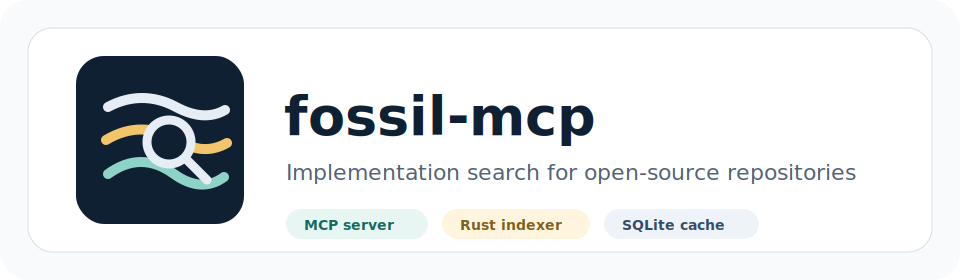

<p align="center">
  
</p>

# fossil-mcp

> MCP server that helps locate where a feature is implemented inside an open-source repository.

fossil-mcp clones a public repository, indexes code symbols, stores the index locally, and exposes MCP tools that an assistant can call when it needs exact files, line ranges, signatures, and nearby call relationships.

It is intentionally modest in scope: it does not claim to understand every behavior in a project, and it does not replace reading the source. Its job is to reduce the time between a natural-language feature question and the implementation candidates worth inspecting.

## Table of contents
- [What this is](#what-this-is)
- [Current capabilities](#current-capabilities)
- [Non-goals](#non-goals)
- [Quick start](#quick-start)
- [Client configuration](#client-configuration)
- [Typical workflows](#typical-workflows)
- [MCP tools](#mcp-tools)
- [Output contracts](#output-contracts)
- [Architecture](#architecture)
- [Crate guide](#crate-guide)
- [Indexing model](#indexing-model)
- [Search model](#search-model)
- [Storage and cache](#storage-and-cache)
- [Environment variables](#environment-variables)
- [Development](#development)
- [Testing](#testing)
- [Operational notes](#operational-notes)
- [Security notes](#security-notes)
- [Limitations](#limitations)
- [Troubleshooting](#troubleshooting)
- [Prompt cookbook](#prompt-cookbook)
- [Maintainer checklist](#maintainer-checklist)
- [Reference appendix](#reference-appendix)
- [Glossary](#glossary)

## What this is

- fossil-mcp is a local MCP server for implementation search.
- It is built for assistants that need source-grounded answers instead of broad repository summaries.
- The server uses stdio transport through the `rmcp` crate.
- The primary workflow is clone, index, locate, then read source.
- Repositories are cloned into a local cache under the user cache directory.
- Code symbols are stored in a local SQLite database so repeated searches do not require re-parsing the repository.
- Search results include symbol names, kinds, language identifiers, file paths, line ranges, signatures, scores, and one-hop related symbols when available.
- The current implementation supports Rust, Python, TypeScript, and JavaScript-family extensions through tree-sitter parsing, with SCIP support when an `index.scip` file is available.
- For Rust repositories, indexing may try to create a SCIP index by invoking `rust-analyzer scip .` when a Cargo manifest exists and no `index.scip` is present.
- When SCIP is unavailable, fossil-mcp falls back to tree-sitter based symbol and call extraction.

## Current capabilities

- Clone public Git repositories with shallow depth.
- Reuse cached clones by stable repository id.
- Refresh a cached repository on demand.
- Assign an optional alias to a cloned repository.
- Checkout a requested branch or tag during clone.
- Index functions, methods, structs, classes, traits, interfaces, enums, and modules where parser support exists.
- Build a simple one-hop call graph from parser-visible call expressions.
- Store repository metadata, symbols, call edges, and embeddings in SQLite.
- Search by natural language or keywords.
- Prefer semantic vector search when embeddings are generated and searchable.
- Fall back to fuzzy symbol search when semantic search does not return results.
- Return source snippets by repository id, relative file path, and inclusive line range.
- List cached and indexed repositories.
- Run a one-shot clone, index, and locate flow through `analyze_feature`.
- Evict old cached repositories when the cache exceeds the configured internal capacity limit.

## Non-goals

- fossil-mcp is not a full program analysis engine.
- fossil-mcp is not a proof system for feature ownership.
- fossil-mcp is not a replacement for language servers, tests, or code review.
- fossil-mcp does not execute target repository code.
- fossil-mcp does not provide vulnerability claims by itself.
- fossil-mcp does not guarantee complete call graph coverage across dynamic dispatch, macros, decorators, generated code, or runtime registration.
- fossil-mcp does not currently index every programming language.
- fossil-mcp does not currently provide a network server transport.
- fossil-mcp should be treated as a locator and triage tool.

## Quick start

- Install a recent Rust toolchain. The workspace uses Rust 2024 edition and declares Rust 1.85 as the minimum supported version.
- Clone this repository.
- Build the release binary.
- Point your MCP client at the compiled `fossil-mcp` executable.
- Use the MCP tools from your assistant session.

```bash
git clone https://github.com/sjkim1127/fossil-mcp
cd fossil-mcp
cargo build --release
```

The binary is expected at:

```text
target/release/fossil-mcp
```

## Client configuration

Use an absolute path to the release binary in your MCP client configuration.

```json
{
  "mcpServers": {
    "fossil-mcp": {
      "command": "/absolute/path/to/fossil-mcp/target/release/fossil-mcp"
    }
  }
}
```

For verbose server-side logging during local development:

```json
{
  "mcpServers": {
    "fossil-mcp": {
      "command": "/absolute/path/to/fossil-mcp/target/release/fossil-mcp",
      "env": {
        "FOSSIL_LOG": "fossil_server=debug,warn"
      }
    }
  }
}
```

## Typical workflows

### Clone, index, locate

1. Call `clone_reference` with a public Git URL.
2. Use the returned `repo_id` with `index_repo`.
3. Call `locate_implementation` with a feature query.
4. Use `get_symbol_source` on the best candidate line range.

### One-shot analysis

1. Call `analyze_feature` with `repo_url` and `query`.
2. Inspect the returned top matches.
3. Fetch source for candidates that look relevant.

### Refresh a repository

1. Call `clone_reference` with `refresh: true`.
2. Run `index_repo` again after the refresh.
3. Search again with the same query to compare results.

### Narrow by language

1. Call `index_repo` with a `languages` list such as `["rust"]`.
2. Use this when a repository includes generated code or frontend code that is not relevant.
3. Remember that filtering happens after symbol extraction.

### Cross-repository lookup

1. Index multiple repositories.
2. Call `locate_implementation` without `repo_id`.
3. Compare the returned `repo_id` and file paths for each match.

## MCP tools

| Tool | Purpose | Typical next step |
|---|---|---|
| `clone_reference` | Clone or reuse a public repository cache. | `index_repo` |
| `index_repo` | Parse source files, store symbols, generate embeddings, and store call edges. | `locate_implementation` |
| `locate_implementation` | Search indexed symbols by feature query or keywords. | `get_symbol_source` |
| `get_symbol_source` | Read a specific relative file path and inclusive line range. | Inspect or cite source |
| `list_indexed_repos` | List cached repository metadata. | Choose a `repo_id` |
| `analyze_feature` | Clone, index when needed, and locate in one call. | Inspect candidates |

### `clone_reference`

- `repo_url` is required.
- `alias` is optional and human-friendly.
- `branch` is optional and passed to the clone builder.
- `refresh` deletes the existing clone before cloning again when true.
- The repository id is derived from the repository URL with a short SHA-256 prefix.
- The clone is shallow with depth 1.
- git2 is tried first, and the git CLI is used as a fallback if git2 clone fails.

### `index_repo`

- `repo_id` is required.
- `languages` is optional; an empty list means all supported languages.
- The indexer checks for `index.scip` and prefers SCIP when present.
- Rust repositories may trigger `rust-analyzer scip .` when no SCIP file exists.
- Tree-sitter indexing is used as the fallback.
- Symbols are persisted to SQLite.
- Embeddings are generated in chunks to reduce memory spikes.
- Call edges are stored after parsing.

### `locate_implementation`

- `query` is required.
- `repo_id` is optional; omit it to search all indexed repositories.
- `top_k` defaults to 5.
- Semantic search is attempted first.
- Fuzzy search is used when semantic search returns no candidates.
- Results include related symbols from one-hop call edges.
- Scores are useful for ranking but should not be treated as certainty.

### `get_symbol_source`

- `repo_id` is required.
- `file_path` is relative to the cloned repository root.
- `line_start` is 1-indexed.
- `line_end` is inclusive.
- The response includes source text and a language label inferred from file extension.
- Use this after `locate_implementation` rather than guessing paths.

### `list_indexed_repos`

- No meaningful input fields are required.
- The response includes repository id, alias, URL, path, indexed timestamp, and symbol count.
- This is useful when continuing an older assistant session.

### `analyze_feature`

- `repo_url` is required.
- `query` is required.
- The tool clones the repository.
- The tool indexes the repository if it was not already indexed.
- The tool calls `locate_implementation` with a broader top-k.
- This is convenient for first-pass exploration.

## Output contracts

The exact JSON is returned as a string through MCP tool responses. Clients usually parse the string before presenting it.

### `clone_reference` fields

- `repo_id`
- `path`
- `indexed`

### `index_repo` fields

- `symbol_count`
- `files_indexed`
- `duration_ms`

### `locate_implementation` fields

- `matches[].repo_id`
- `matches[].symbol_name`
- `matches[].kind`
- `matches[].file_path`
- `matches[].line_start`
- `matches[].line_end`
- `matches[].signature`
- `matches[].score`
- `matches[].related_symbols`

### `get_symbol_source` fields

- `source`
- `language`

### `list_indexed_repos` fields

- `repos[].repo_id`
- `repos[].alias`
- `repos[].url`
- `repos[].path`
- `repos[].indexed_at`
- `repos[].symbol_count`

## Architecture

- **MCP client**: Sends tool calls over stdio.
- **fossil-server**: Receives MCP calls and orchestrates clone, index, search, and source reads.
- **fossil-repo**: Manages clone operations and cache paths.
- **fossil-indexer**: Parses source files and extracts symbols and call edges.
- **fossil-search**: Ranks symbols by semantic or fuzzy search.
- **fossil-core**: Defines shared types, errors, and SQLite storage.
- **SQLite store**: Persists repositories, symbols, embeddings, and call edges.
- **Cache directory**: Stores shallow clones for repeated use.

```text
MCP client
  | stdio
  v
fossil-server
  | clone/index/search/read
  +--> fossil-repo --> cache directory
  +--> fossil-indexer --> symbols and call edges
  +--> fossil-search --> ranked matches
  +--> fossil-core --> SQLite store
```

## Crate guide

- `crates/fossil-core`: Shared model types, storage, and core errors.
- `crates/fossil-repo`: Repository cloning, repository ids, cache paths, and cache eviction.
- `crates/fossil-indexer`: Language parser registry, tree-sitter parsers, SCIP parsing, symbol extraction, and call graph extraction.
- `crates/fossil-search`: Search traits, fuzzy matching, and semantic search helpers.
- `crates/fossil-server`: MCP server entry point and tool definitions.
- `fixtures`: Small source samples used by tests and parser validation.

## Indexing model

- The index stores symbols rather than arbitrary text chunks.
- A symbol usually corresponds to a function, method, class, struct, trait, interface, enum, or module.
- Line ranges are intended to be directly useful for source retrieval.
- Signatures are kept concise so they can be searched and displayed.
- Call edges are simple name-based relationships extracted from parser-visible call expressions.
- SCIP can improve precision when available.
- Tree-sitter fallback keeps the tool useful without a full language-server setup.

## Search model

- Semantic search is attempted first using generated embeddings.
- Fuzzy search uses symbol names and signatures through the fzf-style matcher.
- A good query can be natural language, a subsystem name, an API name, or a phrase from an error message.
- Search results are candidates, not final conclusions.
- The best workflow is to inspect source for at least the top few matches.
- Related symbols help reveal nearby call paths but do not guarantee complete ownership.

## Storage and cache

- The cache root is managed by the core and repo crates.
- Repository ids are stable for the same URL.
- The global SQLite store tracks metadata and indexed content.
- The server marks repositories as accessed during clone and search operations.
- Cache capacity enforcement evicts older repositories when the cache grows beyond the internal limit.
- Deleting the cache is safe when you are willing to re-clone and re-index repositories.

## Environment variables

- `FOSSIL_LOG` controls tracing filters.
- The default filter is suitable for MCP stdio because logs are written to stderr.
- Use `FOSSIL_LOG=fossil_server=debug,warn` for local debugging.
- Avoid writing logs to stdout because stdout is reserved for the MCP transport.

## Development

- Run `cargo fmt` before committing Rust changes.
- Run `cargo check --workspace` for broad compilation feedback.
- Run focused tests in the crate you changed before broad tests when iteration speed matters.
- Keep parser behavior covered by small fixtures whenever possible.
- Prefer adding a language parser through the `LanguageParser` trait and registry.
- Keep MCP response fields stable unless you intend a client-facing contract change.

## Testing

- Parser tests should validate symbol names, kinds, and line ranges.
- Search tests should distinguish ranking behavior from exact score values when possible.
- Server tests can call tool methods directly.
- Repository clone tests should avoid relying on large or unstable external repositories.
- When adding language support, include representative fixtures for classes, functions, methods, and calls.
- When changing storage, test migration or schema compatibility expectations explicitly.

## Operational notes

- Indexing large repositories may take time.
- Embedding generation can be CPU and memory intensive.
- A shallow clone is usually enough for current implementation search.
- Branch-specific searches should pass the branch during clone.
- Generated code can dominate search results; use language filters or improve ignore logic if needed.
- When results look thin, verify that the repository was indexed successfully.

## Security notes

- fossil-mcp clones public repositories requested by the MCP client.
- Do not point the tool at repositories you are not permitted to copy locally.
- Treat cloned code as untrusted content.
- The current implementation reads and parses source but should not execute target repository code as part of indexing.
- The optional `rust-analyzer scip .` invocation runs a local tool against the cloned repository.
- Review operational policy before using this in a restricted environment.

## Limitations

- Dynamic calls may not appear in the call graph.
- Macro-expanded Rust behavior may not be fully represented by tree-sitter extraction.
- Decorators, metaclasses, dependency injection, and runtime registration can hide implementation ownership.
- Semantic ranking depends on embedding quality and stored vectors.
- Fuzzy ranking depends on symbol names and signatures.
- Line ranges depend on parser node ranges and can include more code than a human would quote.
- SCIP behavior depends on external tooling and project support.
- Only supported language parsers are indexed.

## Troubleshooting

| Symptom | Practical check |
|---|---|
| The MCP client cannot start the server | Use an absolute path to `target/release/fossil-mcp` and confirm the binary exists. |
| The client hangs immediately | Check that logs are not written to stdout; MCP stdio requires stdout for protocol messages. |
| Clone fails with a git2 error | The implementation attempts a git CLI fallback; confirm `git` is installed and the repository URL is public. |
| A repository is cloned but not indexed | Run `index_repo` with the returned `repo_id` and inspect the JSON response. |
| Search returns no symbols | Confirm `symbol_count` is greater than zero and that the language is supported. |
| Search returns irrelevant symbols | Try a more implementation-shaped query with function names, API words, or file concepts. |
| Rust indexing is slow | SCIP generation and embedding generation may take time on larger repositories. |
| Related symbols are sparse | The call graph is one-hop and parser-derived; it is useful context, not a complete graph. |
| Source retrieval fails | Use the exact relative `file_path` and line range returned by `locate_implementation`. |
| Cache grows too large | The server enforces an internal capacity limit, and you can also remove the cache manually when needed. |

## Prompt cookbook

1. Find where OAuth token refresh is implemented.
2. Locate the code path that parses CLI arguments.
3. Find the retry loop for failed HTTP requests.
4. Where is repository cache eviction implemented?
5. Find the function that writes search results to SQLite.
6. Locate the source for TypeScript route registration.
7. Find Python class methods that handle authentication.
8. Locate Rust methods that build a call graph.
9. Find where embeddings are generated.
10. Show the source around the best match for cache cleanup.

## Maintainer checklist

- [ ] Keep README tool lists synchronized with `crates/fossil-server/src/tools.rs`.
- [ ] Keep language support notes synchronized with `crates/fossil-indexer/src/languages`.
- [ ] Keep storage notes synchronized with `crates/fossil-core/src/storage.rs`.
- [ ] When adding a tool, document inputs, outputs, and recommended next step.
- [ ] When changing a response field, update the output contract section.
- [ ] When changing cache behavior, update operational and troubleshooting notes.
- [ ] When changing parser behavior, add fixture coverage.
- [ ] When changing search behavior, explain fallback order.
- [ ] When changing logging behavior, preserve MCP stdio compatibility.
- [ ] When cutting a release, update the changelog and release instructions.

## Reference appendix

The following reference sections are intentionally detailed. They are meant to make the README useful as an offline handoff document for users configuring or operating the server.

### Reference note 001

- Use case: implementation search session pattern 001.
- Start from a concrete repository URL whenever possible.
- Clone first, index second, search third, read source fourth.
- Prefer exact API names, feature phrases, or error text in the query.
- Treat the first result as a candidate, not a conclusion.
- Inspect at least one source range before summarizing behavior.
- Use related symbols to decide which neighboring functions to inspect next.
- If a result is too broad, search again with a narrower subsystem word.
- If a result is too narrow, search again with a higher-level feature phrase.
- Record the repository id when the session will continue later.
- Refresh the clone when the upstream branch may have changed.
- Re-index after refresh so line ranges and symbols match the clone.
- Use language filters when generated or unrelated code dominates results.
- Remember that call edges are name-based and one-hop.
- For Rust, SCIP can provide better precision when available.
- For Python, dynamic registration may require manual follow-up.
- For TypeScript, framework conventions may hide entry points.
- For JavaScript, runtime patterns may need additional searches.
- Keep stdout reserved for MCP protocol traffic.
- Send diagnostics to stderr through tracing.

### Reference note 002

- Use case: implementation search session pattern 002.
- Start from a concrete repository URL whenever possible.
- Clone first, index second, search third, read source fourth.
- Prefer exact API names, feature phrases, or error text in the query.
- Treat the first result as a candidate, not a conclusion.
- Inspect at least one source range before summarizing behavior.
- Use related symbols to decide which neighboring functions to inspect next.
- If a result is too broad, search again with a narrower subsystem word.
- If a result is too narrow, search again with a higher-level feature phrase.
- Record the repository id when the session will continue later.
- Refresh the clone when the upstream branch may have changed.
- Re-index after refresh so line ranges and symbols match the clone.
- Use language filters when generated or unrelated code dominates results.
- Remember that call edges are name-based and one-hop.
- For Rust, SCIP can provide better precision when available.
- For Python, dynamic registration may require manual follow-up.
- For TypeScript, framework conventions may hide entry points.
- For JavaScript, runtime patterns may need additional searches.
- Keep stdout reserved for MCP protocol traffic.
- Send diagnostics to stderr through tracing.

### Reference note 003

- Use case: implementation search session pattern 003.
- Start from a concrete repository URL whenever possible.
- Clone first, index second, search third, read source fourth.
- Prefer exact API names, feature phrases, or error text in the query.
- Treat the first result as a candidate, not a conclusion.
- Inspect at least one source range before summarizing behavior.
- Use related symbols to decide which neighboring functions to inspect next.
- If a result is too broad, search again with a narrower subsystem word.
- If a result is too narrow, search again with a higher-level feature phrase.
- Record the repository id when the session will continue later.
- Refresh the clone when the upstream branch may have changed.
- Re-index after refresh so line ranges and symbols match the clone.
- Use language filters when generated or unrelated code dominates results.
- Remember that call edges are name-based and one-hop.
- For Rust, SCIP can provide better precision when available.
- For Python, dynamic registration may require manual follow-up.
- For TypeScript, framework conventions may hide entry points.
- For JavaScript, runtime patterns may need additional searches.
- Keep stdout reserved for MCP protocol traffic.
- Send diagnostics to stderr through tracing.

### Reference note 004

- Use case: implementation search session pattern 004.
- Start from a concrete repository URL whenever possible.
- Clone first, index second, search third, read source fourth.
- Prefer exact API names, feature phrases, or error text in the query.
- Treat the first result as a candidate, not a conclusion.
- Inspect at least one source range before summarizing behavior.
- Use related symbols to decide which neighboring functions to inspect next.
- If a result is too broad, search again with a narrower subsystem word.
- If a result is too narrow, search again with a higher-level feature phrase.
- Record the repository id when the session will continue later.
- Refresh the clone when the upstream branch may have changed.
- Re-index after refresh so line ranges and symbols match the clone.
- Use language filters when generated or unrelated code dominates results.
- Remember that call edges are name-based and one-hop.
- For Rust, SCIP can provide better precision when available.
- For Python, dynamic registration may require manual follow-up.
- For TypeScript, framework conventions may hide entry points.
- For JavaScript, runtime patterns may need additional searches.
- Keep stdout reserved for MCP protocol traffic.
- Send diagnostics to stderr through tracing.

### Reference note 005

- Use case: implementation search session pattern 005.
- Start from a concrete repository URL whenever possible.
- Clone first, index second, search third, read source fourth.
- Prefer exact API names, feature phrases, or error text in the query.
- Treat the first result as a candidate, not a conclusion.
- Inspect at least one source range before summarizing behavior.
- Use related symbols to decide which neighboring functions to inspect next.
- If a result is too broad, search again with a narrower subsystem word.
- If a result is too narrow, search again with a higher-level feature phrase.
- Record the repository id when the session will continue later.
- Refresh the clone when the upstream branch may have changed.
- Re-index after refresh so line ranges and symbols match the clone.
- Use language filters when generated or unrelated code dominates results.
- Remember that call edges are name-based and one-hop.
- For Rust, SCIP can provide better precision when available.
- For Python, dynamic registration may require manual follow-up.
- For TypeScript, framework conventions may hide entry points.
- For JavaScript, runtime patterns may need additional searches.
- Keep stdout reserved for MCP protocol traffic.
- Send diagnostics to stderr through tracing.

### Reference note 006

- Use case: implementation search session pattern 006.
- Start from a concrete repository URL whenever possible.
- Clone first, index second, search third, read source fourth.
- Prefer exact API names, feature phrases, or error text in the query.
- Treat the first result as a candidate, not a conclusion.
- Inspect at least one source range before summarizing behavior.
- Use related symbols to decide which neighboring functions to inspect next.
- If a result is too broad, search again with a narrower subsystem word.
- If a result is too narrow, search again with a higher-level feature phrase.
- Record the repository id when the session will continue later.
- Refresh the clone when the upstream branch may have changed.
- Re-index after refresh so line ranges and symbols match the clone.
- Use language filters when generated or unrelated code dominates results.
- Remember that call edges are name-based and one-hop.
- For Rust, SCIP can provide better precision when available.
- For Python, dynamic registration may require manual follow-up.
- For TypeScript, framework conventions may hide entry points.
- For JavaScript, runtime patterns may need additional searches.
- Keep stdout reserved for MCP protocol traffic.
- Send diagnostics to stderr through tracing.

### Reference note 007

- Use case: implementation search session pattern 007.
- Start from a concrete repository URL whenever possible.
- Clone first, index second, search third, read source fourth.
- Prefer exact API names, feature phrases, or error text in the query.
- Treat the first result as a candidate, not a conclusion.
- Inspect at least one source range before summarizing behavior.
- Use related symbols to decide which neighboring functions to inspect next.
- If a result is too broad, search again with a narrower subsystem word.
- If a result is too narrow, search again with a higher-level feature phrase.
- Record the repository id when the session will continue later.
- Refresh the clone when the upstream branch may have changed.
- Re-index after refresh so line ranges and symbols match the clone.
- Use language filters when generated or unrelated code dominates results.
- Remember that call edges are name-based and one-hop.
- For Rust, SCIP can provide better precision when available.
- For Python, dynamic registration may require manual follow-up.
- For TypeScript, framework conventions may hide entry points.
- For JavaScript, runtime patterns may need additional searches.
- Keep stdout reserved for MCP protocol traffic.
- Send diagnostics to stderr through tracing.

### Reference note 008

- Use case: implementation search session pattern 008.
- Start from a concrete repository URL whenever possible.
- Clone first, index second, search third, read source fourth.
- Prefer exact API names, feature phrases, or error text in the query.
- Treat the first result as a candidate, not a conclusion.
- Inspect at least one source range before summarizing behavior.
- Use related symbols to decide which neighboring functions to inspect next.
- If a result is too broad, search again with a narrower subsystem word.
- If a result is too narrow, search again with a higher-level feature phrase.
- Record the repository id when the session will continue later.
- Refresh the clone when the upstream branch may have changed.
- Re-index after refresh so line ranges and symbols match the clone.
- Use language filters when generated or unrelated code dominates results.
- Remember that call edges are name-based and one-hop.
- For Rust, SCIP can provide better precision when available.
- For Python, dynamic registration may require manual follow-up.
- For TypeScript, framework conventions may hide entry points.
- For JavaScript, runtime patterns may need additional searches.
- Keep stdout reserved for MCP protocol traffic.
- Send diagnostics to stderr through tracing.

### Reference note 009

- Use case: implementation search session pattern 009.
- Start from a concrete repository URL whenever possible.
- Clone first, index second, search third, read source fourth.
- Prefer exact API names, feature phrases, or error text in the query.
- Treat the first result as a candidate, not a conclusion.
- Inspect at least one source range before summarizing behavior.
- Use related symbols to decide which neighboring functions to inspect next.
- If a result is too broad, search again with a narrower subsystem word.
- If a result is too narrow, search again with a higher-level feature phrase.
- Record the repository id when the session will continue later.
- Refresh the clone when the upstream branch may have changed.
- Re-index after refresh so line ranges and symbols match the clone.
- Use language filters when generated or unrelated code dominates results.
- Remember that call edges are name-based and one-hop.
- For Rust, SCIP can provide better precision when available.
- For Python, dynamic registration may require manual follow-up.
- For TypeScript, framework conventions may hide entry points.
- For JavaScript, runtime patterns may need additional searches.
- Keep stdout reserved for MCP protocol traffic.
- Send diagnostics to stderr through tracing.

### Reference note 010

- Use case: implementation search session pattern 010.
- Start from a concrete repository URL whenever possible.
- Clone first, index second, search third, read source fourth.
- Prefer exact API names, feature phrases, or error text in the query.
- Treat the first result as a candidate, not a conclusion.
- Inspect at least one source range before summarizing behavior.
- Use related symbols to decide which neighboring functions to inspect next.
- If a result is too broad, search again with a narrower subsystem word.
- If a result is too narrow, search again with a higher-level feature phrase.
- Record the repository id when the session will continue later.
- Refresh the clone when the upstream branch may have changed.
- Re-index after refresh so line ranges and symbols match the clone.
- Use language filters when generated or unrelated code dominates results.
- Remember that call edges are name-based and one-hop.
- For Rust, SCIP can provide better precision when available.
- For Python, dynamic registration may require manual follow-up.
- For TypeScript, framework conventions may hide entry points.
- For JavaScript, runtime patterns may need additional searches.
- Keep stdout reserved for MCP protocol traffic.
- Send diagnostics to stderr through tracing.

### Reference note 011

- Use case: implementation search session pattern 011.
- Start from a concrete repository URL whenever possible.
- Clone first, index second, search third, read source fourth.
- Prefer exact API names, feature phrases, or error text in the query.
- Treat the first result as a candidate, not a conclusion.
- Inspect at least one source range before summarizing behavior.
- Use related symbols to decide which neighboring functions to inspect next.
- If a result is too broad, search again with a narrower subsystem word.
- If a result is too narrow, search again with a higher-level feature phrase.
- Record the repository id when the session will continue later.
- Refresh the clone when the upstream branch may have changed.
- Re-index after refresh so line ranges and symbols match the clone.
- Use language filters when generated or unrelated code dominates results.
- Remember that call edges are name-based and one-hop.
- For Rust, SCIP can provide better precision when available.
- For Python, dynamic registration may require manual follow-up.
- For TypeScript, framework conventions may hide entry points.
- For JavaScript, runtime patterns may need additional searches.
- Keep stdout reserved for MCP protocol traffic.
- Send diagnostics to stderr through tracing.

### Reference note 012

- Use case: implementation search session pattern 012.
- Start from a concrete repository URL whenever possible.
- Clone first, index second, search third, read source fourth.
- Prefer exact API names, feature phrases, or error text in the query.
- Treat the first result as a candidate, not a conclusion.
- Inspect at least one source range before summarizing behavior.
- Use related symbols to decide which neighboring functions to inspect next.
- If a result is too broad, search again with a narrower subsystem word.
- If a result is too narrow, search again with a higher-level feature phrase.
- Record the repository id when the session will continue later.
- Refresh the clone when the upstream branch may have changed.
- Re-index after refresh so line ranges and symbols match the clone.
- Use language filters when generated or unrelated code dominates results.
- Remember that call edges are name-based and one-hop.
- For Rust, SCIP can provide better precision when available.
- For Python, dynamic registration may require manual follow-up.
- For TypeScript, framework conventions may hide entry points.
- For JavaScript, runtime patterns may need additional searches.
- Keep stdout reserved for MCP protocol traffic.
- Send diagnostics to stderr through tracing.

### Reference note 013

- Use case: implementation search session pattern 013.
- Start from a concrete repository URL whenever possible.
- Clone first, index second, search third, read source fourth.
- Prefer exact API names, feature phrases, or error text in the query.
- Treat the first result as a candidate, not a conclusion.
- Inspect at least one source range before summarizing behavior.
- Use related symbols to decide which neighboring functions to inspect next.
- If a result is too broad, search again with a narrower subsystem word.
- If a result is too narrow, search again with a higher-level feature phrase.
- Record the repository id when the session will continue later.
- Refresh the clone when the upstream branch may have changed.
- Re-index after refresh so line ranges and symbols match the clone.
- Use language filters when generated or unrelated code dominates results.
- Remember that call edges are name-based and one-hop.
- For Rust, SCIP can provide better precision when available.
- For Python, dynamic registration may require manual follow-up.
- For TypeScript, framework conventions may hide entry points.
- For JavaScript, runtime patterns may need additional searches.
- Keep stdout reserved for MCP protocol traffic.
- Send diagnostics to stderr through tracing.

### Reference note 014

- Use case: implementation search session pattern 014.
- Start from a concrete repository URL whenever possible.
- Clone first, index second, search third, read source fourth.
- Prefer exact API names, feature phrases, or error text in the query.
- Treat the first result as a candidate, not a conclusion.
- Inspect at least one source range before summarizing behavior.
- Use related symbols to decide which neighboring functions to inspect next.
- If a result is too broad, search again with a narrower subsystem word.
- If a result is too narrow, search again with a higher-level feature phrase.
- Record the repository id when the session will continue later.
- Refresh the clone when the upstream branch may have changed.
- Re-index after refresh so line ranges and symbols match the clone.
- Use language filters when generated or unrelated code dominates results.
- Remember that call edges are name-based and one-hop.
- For Rust, SCIP can provide better precision when available.
- For Python, dynamic registration may require manual follow-up.
- For TypeScript, framework conventions may hide entry points.
- For JavaScript, runtime patterns may need additional searches.
- Keep stdout reserved for MCP protocol traffic.
- Send diagnostics to stderr through tracing.

### Reference note 015

- Use case: implementation search session pattern 015.
- Start from a concrete repository URL whenever possible.
- Clone first, index second, search third, read source fourth.
- Prefer exact API names, feature phrases, or error text in the query.
- Treat the first result as a candidate, not a conclusion.
- Inspect at least one source range before summarizing behavior.
- Use related symbols to decide which neighboring functions to inspect next.
- If a result is too broad, search again with a narrower subsystem word.
- If a result is too narrow, search again with a higher-level feature phrase.
- Record the repository id when the session will continue later.
- Refresh the clone when the upstream branch may have changed.
- Re-index after refresh so line ranges and symbols match the clone.
- Use language filters when generated or unrelated code dominates results.
- Remember that call edges are name-based and one-hop.
- For Rust, SCIP can provide better precision when available.
- For Python, dynamic registration may require manual follow-up.
- For TypeScript, framework conventions may hide entry points.
- For JavaScript, runtime patterns may need additional searches.
- Keep stdout reserved for MCP protocol traffic.
- Send diagnostics to stderr through tracing.

### Reference note 016

- Use case: implementation search session pattern 016.
- Start from a concrete repository URL whenever possible.
- Clone first, index second, search third, read source fourth.
- Prefer exact API names, feature phrases, or error text in the query.
- Treat the first result as a candidate, not a conclusion.
- Inspect at least one source range before summarizing behavior.
- Use related symbols to decide which neighboring functions to inspect next.
- If a result is too broad, search again with a narrower subsystem word.
- If a result is too narrow, search again with a higher-level feature phrase.
- Record the repository id when the session will continue later.
- Refresh the clone when the upstream branch may have changed.
- Re-index after refresh so line ranges and symbols match the clone.
- Use language filters when generated or unrelated code dominates results.
- Remember that call edges are name-based and one-hop.
- For Rust, SCIP can provide better precision when available.
- For Python, dynamic registration may require manual follow-up.
- For TypeScript, framework conventions may hide entry points.
- For JavaScript, runtime patterns may need additional searches.
- Keep stdout reserved for MCP protocol traffic.
- Send diagnostics to stderr through tracing.

### Reference note 017

- Use case: implementation search session pattern 017.
- Start from a concrete repository URL whenever possible.
- Clone first, index second, search third, read source fourth.
- Prefer exact API names, feature phrases, or error text in the query.
- Treat the first result as a candidate, not a conclusion.
- Inspect at least one source range before summarizing behavior.
- Use related symbols to decide which neighboring functions to inspect next.
- If a result is too broad, search again with a narrower subsystem word.
- If a result is too narrow, search again with a higher-level feature phrase.
- Record the repository id when the session will continue later.
- Refresh the clone when the upstream branch may have changed.
- Re-index after refresh so line ranges and symbols match the clone.
- Use language filters when generated or unrelated code dominates results.
- Remember that call edges are name-based and one-hop.
- For Rust, SCIP can provide better precision when available.
- For Python, dynamic registration may require manual follow-up.
- For TypeScript, framework conventions may hide entry points.
- For JavaScript, runtime patterns may need additional searches.
- Keep stdout reserved for MCP protocol traffic.
- Send diagnostics to stderr through tracing.

### Reference note 018

- Use case: implementation search session pattern 018.
- Start from a concrete repository URL whenever possible.
- Clone first, index second, search third, read source fourth.
- Prefer exact API names, feature phrases, or error text in the query.
- Treat the first result as a candidate, not a conclusion.
- Inspect at least one source range before summarizing behavior.
- Use related symbols to decide which neighboring functions to inspect next.
- If a result is too broad, search again with a narrower subsystem word.
- If a result is too narrow, search again with a higher-level feature phrase.
- Record the repository id when the session will continue later.
- Refresh the clone when the upstream branch may have changed.
- Re-index after refresh so line ranges and symbols match the clone.
- Use language filters when generated or unrelated code dominates results.
- Remember that call edges are name-based and one-hop.
- For Rust, SCIP can provide better precision when available.
- For Python, dynamic registration may require manual follow-up.
- For TypeScript, framework conventions may hide entry points.
- For JavaScript, runtime patterns may need additional searches.
- Keep stdout reserved for MCP protocol traffic.
- Send diagnostics to stderr through tracing.

### Reference note 019

- Use case: implementation search session pattern 019.
- Start from a concrete repository URL whenever possible.
- Clone first, index second, search third, read source fourth.
- Prefer exact API names, feature phrases, or error text in the query.
- Treat the first result as a candidate, not a conclusion.
- Inspect at least one source range before summarizing behavior.
- Use related symbols to decide which neighboring functions to inspect next.
- If a result is too broad, search again with a narrower subsystem word.
- If a result is too narrow, search again with a higher-level feature phrase.
- Record the repository id when the session will continue later.
- Refresh the clone when the upstream branch may have changed.
- Re-index after refresh so line ranges and symbols match the clone.
- Use language filters when generated or unrelated code dominates results.
- Remember that call edges are name-based and one-hop.
- For Rust, SCIP can provide better precision when available.
- For Python, dynamic registration may require manual follow-up.
- For TypeScript, framework conventions may hide entry points.
- For JavaScript, runtime patterns may need additional searches.
- Keep stdout reserved for MCP protocol traffic.
- Send diagnostics to stderr through tracing.

### Reference note 020

- Use case: implementation search session pattern 020.
- Start from a concrete repository URL whenever possible.
- Clone first, index second, search third, read source fourth.
- Prefer exact API names, feature phrases, or error text in the query.
- Treat the first result as a candidate, not a conclusion.
- Inspect at least one source range before summarizing behavior.
- Use related symbols to decide which neighboring functions to inspect next.
- If a result is too broad, search again with a narrower subsystem word.
- If a result is too narrow, search again with a higher-level feature phrase.
- Record the repository id when the session will continue later.
- Refresh the clone when the upstream branch may have changed.
- Re-index after refresh so line ranges and symbols match the clone.
- Use language filters when generated or unrelated code dominates results.
- Remember that call edges are name-based and one-hop.
- For Rust, SCIP can provide better precision when available.
- For Python, dynamic registration may require manual follow-up.
- For TypeScript, framework conventions may hide entry points.
- For JavaScript, runtime patterns may need additional searches.
- Keep stdout reserved for MCP protocol traffic.
- Send diagnostics to stderr through tracing.

### Reference note 021

- Use case: implementation search session pattern 021.
- Start from a concrete repository URL whenever possible.
- Clone first, index second, search third, read source fourth.
- Prefer exact API names, feature phrases, or error text in the query.
- Treat the first result as a candidate, not a conclusion.
- Inspect at least one source range before summarizing behavior.
- Use related symbols to decide which neighboring functions to inspect next.
- If a result is too broad, search again with a narrower subsystem word.
- If a result is too narrow, search again with a higher-level feature phrase.
- Record the repository id when the session will continue later.
- Refresh the clone when the upstream branch may have changed.
- Re-index after refresh so line ranges and symbols match the clone.
- Use language filters when generated or unrelated code dominates results.
- Remember that call edges are name-based and one-hop.
- For Rust, SCIP can provide better precision when available.
- For Python, dynamic registration may require manual follow-up.
- For TypeScript, framework conventions may hide entry points.
- For JavaScript, runtime patterns may need additional searches.
- Keep stdout reserved for MCP protocol traffic.
- Send diagnostics to stderr through tracing.

### Reference note 022

- Use case: implementation search session pattern 022.
- Start from a concrete repository URL whenever possible.
- Clone first, index second, search third, read source fourth.
- Prefer exact API names, feature phrases, or error text in the query.
- Treat the first result as a candidate, not a conclusion.
- Inspect at least one source range before summarizing behavior.
- Use related symbols to decide which neighboring functions to inspect next.
- If a result is too broad, search again with a narrower subsystem word.
- If a result is too narrow, search again with a higher-level feature phrase.
- Record the repository id when the session will continue later.
- Refresh the clone when the upstream branch may have changed.
- Re-index after refresh so line ranges and symbols match the clone.
- Use language filters when generated or unrelated code dominates results.
- Remember that call edges are name-based and one-hop.
- For Rust, SCIP can provide better precision when available.
- For Python, dynamic registration may require manual follow-up.
- For TypeScript, framework conventions may hide entry points.
- For JavaScript, runtime patterns may need additional searches.
- Keep stdout reserved for MCP protocol traffic.
- Send diagnostics to stderr through tracing.

### Reference note 023

- Use case: implementation search session pattern 023.
- Start from a concrete repository URL whenever possible.
- Clone first, index second, search third, read source fourth.
- Prefer exact API names, feature phrases, or error text in the query.
- Treat the first result as a candidate, not a conclusion.
- Inspect at least one source range before summarizing behavior.
- Use related symbols to decide which neighboring functions to inspect next.
- If a result is too broad, search again with a narrower subsystem word.
- If a result is too narrow, search again with a higher-level feature phrase.
- Record the repository id when the session will continue later.
- Refresh the clone when the upstream branch may have changed.
- Re-index after refresh so line ranges and symbols match the clone.
- Use language filters when generated or unrelated code dominates results.
- Remember that call edges are name-based and one-hop.
- For Rust, SCIP can provide better precision when available.
- For Python, dynamic registration may require manual follow-up.
- For TypeScript, framework conventions may hide entry points.
- For JavaScript, runtime patterns may need additional searches.
- Keep stdout reserved for MCP protocol traffic.
- Send diagnostics to stderr through tracing.

### Reference note 024

- Use case: implementation search session pattern 024.
- Start from a concrete repository URL whenever possible.
- Clone first, index second, search third, read source fourth.
- Prefer exact API names, feature phrases, or error text in the query.
- Treat the first result as a candidate, not a conclusion.
- Inspect at least one source range before summarizing behavior.
- Use related symbols to decide which neighboring functions to inspect next.
- If a result is too broad, search again with a narrower subsystem word.
- If a result is too narrow, search again with a higher-level feature phrase.
- Record the repository id when the session will continue later.
- Refresh the clone when the upstream branch may have changed.
- Re-index after refresh so line ranges and symbols match the clone.
- Use language filters when generated or unrelated code dominates results.
- Remember that call edges are name-based and one-hop.
- For Rust, SCIP can provide better precision when available.
- For Python, dynamic registration may require manual follow-up.
- For TypeScript, framework conventions may hide entry points.
- For JavaScript, runtime patterns may need additional searches.
- Keep stdout reserved for MCP protocol traffic.
- Send diagnostics to stderr through tracing.

### Reference note 025

- Use case: implementation search session pattern 025.
- Start from a concrete repository URL whenever possible.
- Clone first, index second, search third, read source fourth.
- Prefer exact API names, feature phrases, or error text in the query.
- Treat the first result as a candidate, not a conclusion.
- Inspect at least one source range before summarizing behavior.
- Use related symbols to decide which neighboring functions to inspect next.
- If a result is too broad, search again with a narrower subsystem word.
- If a result is too narrow, search again with a higher-level feature phrase.
- Record the repository id when the session will continue later.
- Refresh the clone when the upstream branch may have changed.
- Re-index after refresh so line ranges and symbols match the clone.
- Use language filters when generated or unrelated code dominates results.
- Remember that call edges are name-based and one-hop.
- For Rust, SCIP can provide better precision when available.
- For Python, dynamic registration may require manual follow-up.
- For TypeScript, framework conventions may hide entry points.
- For JavaScript, runtime patterns may need additional searches.
- Keep stdout reserved for MCP protocol traffic.
- Send diagnostics to stderr through tracing.

### Reference note 026

- Use case: implementation search session pattern 026.
- Start from a concrete repository URL whenever possible.
- Clone first, index second, search third, read source fourth.
- Prefer exact API names, feature phrases, or error text in the query.
- Treat the first result as a candidate, not a conclusion.
- Inspect at least one source range before summarizing behavior.
- Use related symbols to decide which neighboring functions to inspect next.
- If a result is too broad, search again with a narrower subsystem word.
- If a result is too narrow, search again with a higher-level feature phrase.
- Record the repository id when the session will continue later.
- Refresh the clone when the upstream branch may have changed.
- Re-index after refresh so line ranges and symbols match the clone.
- Use language filters when generated or unrelated code dominates results.
- Remember that call edges are name-based and one-hop.
- For Rust, SCIP can provide better precision when available.
- For Python, dynamic registration may require manual follow-up.
- For TypeScript, framework conventions may hide entry points.
- For JavaScript, runtime patterns may need additional searches.
- Keep stdout reserved for MCP protocol traffic.
- Send diagnostics to stderr through tracing.

### Reference note 027

- Use case: implementation search session pattern 027.
- Start from a concrete repository URL whenever possible.
- Clone first, index second, search third, read source fourth.
- Prefer exact API names, feature phrases, or error text in the query.
- Treat the first result as a candidate, not a conclusion.
- Inspect at least one source range before summarizing behavior.
- Use related symbols to decide which neighboring functions to inspect next.
- If a result is too broad, search again with a narrower subsystem word.
- If a result is too narrow, search again with a higher-level feature phrase.
- Record the repository id when the session will continue later.
- Refresh the clone when the upstream branch may have changed.
- Re-index after refresh so line ranges and symbols match the clone.
- Use language filters when generated or unrelated code dominates results.
- Remember that call edges are name-based and one-hop.
- For Rust, SCIP can provide better precision when available.
- For Python, dynamic registration may require manual follow-up.
- For TypeScript, framework conventions may hide entry points.
- For JavaScript, runtime patterns may need additional searches.
- Keep stdout reserved for MCP protocol traffic.
- Send diagnostics to stderr through tracing.

### Reference note 028

- Use case: implementation search session pattern 028.
- Start from a concrete repository URL whenever possible.
- Clone first, index second, search third, read source fourth.
- Prefer exact API names, feature phrases, or error text in the query.
- Treat the first result as a candidate, not a conclusion.
- Inspect at least one source range before summarizing behavior.
- Use related symbols to decide which neighboring functions to inspect next.
- If a result is too broad, search again with a narrower subsystem word.
- If a result is too narrow, search again with a higher-level feature phrase.
- Record the repository id when the session will continue later.
- Refresh the clone when the upstream branch may have changed.
- Re-index after refresh so line ranges and symbols match the clone.
- Use language filters when generated or unrelated code dominates results.
- Remember that call edges are name-based and one-hop.
- For Rust, SCIP can provide better precision when available.
- For Python, dynamic registration may require manual follow-up.
- For TypeScript, framework conventions may hide entry points.
- For JavaScript, runtime patterns may need additional searches.
- Keep stdout reserved for MCP protocol traffic.
- Send diagnostics to stderr through tracing.

### Reference note 029

- Use case: implementation search session pattern 029.
- Start from a concrete repository URL whenever possible.
- Clone first, index second, search third, read source fourth.
- Prefer exact API names, feature phrases, or error text in the query.
- Treat the first result as a candidate, not a conclusion.
- Inspect at least one source range before summarizing behavior.
- Use related symbols to decide which neighboring functions to inspect next.
- If a result is too broad, search again with a narrower subsystem word.
- If a result is too narrow, search again with a higher-level feature phrase.
- Record the repository id when the session will continue later.
- Refresh the clone when the upstream branch may have changed.
- Re-index after refresh so line ranges and symbols match the clone.
- Use language filters when generated or unrelated code dominates results.
- Remember that call edges are name-based and one-hop.
- For Rust, SCIP can provide better precision when available.
- For Python, dynamic registration may require manual follow-up.
- For TypeScript, framework conventions may hide entry points.
- For JavaScript, runtime patterns may need additional searches.
- Keep stdout reserved for MCP protocol traffic.
- Send diagnostics to stderr through tracing.

### Reference note 030

- Use case: implementation search session pattern 030.
- Start from a concrete repository URL whenever possible.
- Clone first, index second, search third, read source fourth.
- Prefer exact API names, feature phrases, or error text in the query.
- Treat the first result as a candidate, not a conclusion.
- Inspect at least one source range before summarizing behavior.
- Use related symbols to decide which neighboring functions to inspect next.
- If a result is too broad, search again with a narrower subsystem word.
- If a result is too narrow, search again with a higher-level feature phrase.
- Record the repository id when the session will continue later.
- Refresh the clone when the upstream branch may have changed.
- Re-index after refresh so line ranges and symbols match the clone.
- Use language filters when generated or unrelated code dominates results.
- Remember that call edges are name-based and one-hop.
- For Rust, SCIP can provide better precision when available.
- For Python, dynamic registration may require manual follow-up.
- For TypeScript, framework conventions may hide entry points.
- For JavaScript, runtime patterns may need additional searches.
- Keep stdout reserved for MCP protocol traffic.
- Send diagnostics to stderr through tracing.

### Reference note 031

- Use case: implementation search session pattern 031.
- Start from a concrete repository URL whenever possible.
- Clone first, index second, search third, read source fourth.
- Prefer exact API names, feature phrases, or error text in the query.
- Treat the first result as a candidate, not a conclusion.
- Inspect at least one source range before summarizing behavior.
- Use related symbols to decide which neighboring functions to inspect next.
- If a result is too broad, search again with a narrower subsystem word.
- If a result is too narrow, search again with a higher-level feature phrase.
- Record the repository id when the session will continue later.
- Refresh the clone when the upstream branch may have changed.
- Re-index after refresh so line ranges and symbols match the clone.
- Use language filters when generated or unrelated code dominates results.
- Remember that call edges are name-based and one-hop.
- For Rust, SCIP can provide better precision when available.
- For Python, dynamic registration may require manual follow-up.
- For TypeScript, framework conventions may hide entry points.
- For JavaScript, runtime patterns may need additional searches.
- Keep stdout reserved for MCP protocol traffic.
- Send diagnostics to stderr through tracing.

### Reference note 032

- Use case: implementation search session pattern 032.
- Start from a concrete repository URL whenever possible.
- Clone first, index second, search third, read source fourth.
- Prefer exact API names, feature phrases, or error text in the query.
- Treat the first result as a candidate, not a conclusion.
- Inspect at least one source range before summarizing behavior.
- Use related symbols to decide which neighboring functions to inspect next.
- If a result is too broad, search again with a narrower subsystem word.
- If a result is too narrow, search again with a higher-level feature phrase.
- Record the repository id when the session will continue later.
- Refresh the clone when the upstream branch may have changed.
- Re-index after refresh so line ranges and symbols match the clone.
- Use language filters when generated or unrelated code dominates results.
- Remember that call edges are name-based and one-hop.
- For Rust, SCIP can provide better precision when available.
- For Python, dynamic registration may require manual follow-up.
- For TypeScript, framework conventions may hide entry points.
- For JavaScript, runtime patterns may need additional searches.
- Keep stdout reserved for MCP protocol traffic.
- Send diagnostics to stderr through tracing.

### Reference note 033

- Use case: implementation search session pattern 033.
- Start from a concrete repository URL whenever possible.
- Clone first, index second, search third, read source fourth.
- Prefer exact API names, feature phrases, or error text in the query.
- Treat the first result as a candidate, not a conclusion.
- Inspect at least one source range before summarizing behavior.
- Use related symbols to decide which neighboring functions to inspect next.
- If a result is too broad, search again with a narrower subsystem word.
- If a result is too narrow, search again with a higher-level feature phrase.
- Record the repository id when the session will continue later.
- Refresh the clone when the upstream branch may have changed.
- Re-index after refresh so line ranges and symbols match the clone.
- Use language filters when generated or unrelated code dominates results.
- Remember that call edges are name-based and one-hop.
- For Rust, SCIP can provide better precision when available.
- For Python, dynamic registration may require manual follow-up.
- For TypeScript, framework conventions may hide entry points.
- For JavaScript, runtime patterns may need additional searches.
- Keep stdout reserved for MCP protocol traffic.
- Send diagnostics to stderr through tracing.

### Reference note 034

- Use case: implementation search session pattern 034.
- Start from a concrete repository URL whenever possible.
- Clone first, index second, search third, read source fourth.
- Prefer exact API names, feature phrases, or error text in the query.
- Treat the first result as a candidate, not a conclusion.
- Inspect at least one source range before summarizing behavior.
- Use related symbols to decide which neighboring functions to inspect next.
- If a result is too broad, search again with a narrower subsystem word.
- If a result is too narrow, search again with a higher-level feature phrase.
- Record the repository id when the session will continue later.
- Refresh the clone when the upstream branch may have changed.
- Re-index after refresh so line ranges and symbols match the clone.
- Use language filters when generated or unrelated code dominates results.
- Remember that call edges are name-based and one-hop.
- For Rust, SCIP can provide better precision when available.
- For Python, dynamic registration may require manual follow-up.
- For TypeScript, framework conventions may hide entry points.
- For JavaScript, runtime patterns may need additional searches.
- Keep stdout reserved for MCP protocol traffic.
- Send diagnostics to stderr through tracing.

### Reference note 035

- Use case: implementation search session pattern 035.
- Start from a concrete repository URL whenever possible.
- Clone first, index second, search third, read source fourth.
- Prefer exact API names, feature phrases, or error text in the query.
- Treat the first result as a candidate, not a conclusion.
- Inspect at least one source range before summarizing behavior.
- Use related symbols to decide which neighboring functions to inspect next.
- If a result is too broad, search again with a narrower subsystem word.
- If a result is too narrow, search again with a higher-level feature phrase.
- Record the repository id when the session will continue later.
- Refresh the clone when the upstream branch may have changed.
- Re-index after refresh so line ranges and symbols match the clone.
- Use language filters when generated or unrelated code dominates results.
- Remember that call edges are name-based and one-hop.
- For Rust, SCIP can provide better precision when available.
- For Python, dynamic registration may require manual follow-up.
- For TypeScript, framework conventions may hide entry points.
- For JavaScript, runtime patterns may need additional searches.
- Keep stdout reserved for MCP protocol traffic.
- Send diagnostics to stderr through tracing.

### Reference note 036

- Use case: implementation search session pattern 036.
- Start from a concrete repository URL whenever possible.
- Clone first, index second, search third, read source fourth.
- Prefer exact API names, feature phrases, or error text in the query.
- Treat the first result as a candidate, not a conclusion.
- Inspect at least one source range before summarizing behavior.
- Use related symbols to decide which neighboring functions to inspect next.
- If a result is too broad, search again with a narrower subsystem word.
- If a result is too narrow, search again with a higher-level feature phrase.
- Record the repository id when the session will continue later.
- Refresh the clone when the upstream branch may have changed.
- Re-index after refresh so line ranges and symbols match the clone.
- Use language filters when generated or unrelated code dominates results.
- Remember that call edges are name-based and one-hop.
- For Rust, SCIP can provide better precision when available.
- For Python, dynamic registration may require manual follow-up.
- For TypeScript, framework conventions may hide entry points.
- For JavaScript, runtime patterns may need additional searches.
- Keep stdout reserved for MCP protocol traffic.
- Send diagnostics to stderr through tracing.

### Reference note 037

- Use case: implementation search session pattern 037.
- Start from a concrete repository URL whenever possible.
- Clone first, index second, search third, read source fourth.
- Prefer exact API names, feature phrases, or error text in the query.
- Treat the first result as a candidate, not a conclusion.
- Inspect at least one source range before summarizing behavior.
- Use related symbols to decide which neighboring functions to inspect next.
- If a result is too broad, search again with a narrower subsystem word.
- If a result is too narrow, search again with a higher-level feature phrase.
- Record the repository id when the session will continue later.
- Refresh the clone when the upstream branch may have changed.
- Re-index after refresh so line ranges and symbols match the clone.
- Use language filters when generated or unrelated code dominates results.
- Remember that call edges are name-based and one-hop.
- For Rust, SCIP can provide better precision when available.
- For Python, dynamic registration may require manual follow-up.
- For TypeScript, framework conventions may hide entry points.
- For JavaScript, runtime patterns may need additional searches.
- Keep stdout reserved for MCP protocol traffic.
- Send diagnostics to stderr through tracing.

### Reference note 038

- Use case: implementation search session pattern 038.
- Start from a concrete repository URL whenever possible.
- Clone first, index second, search third, read source fourth.
- Prefer exact API names, feature phrases, or error text in the query.
- Treat the first result as a candidate, not a conclusion.
- Inspect at least one source range before summarizing behavior.
- Use related symbols to decide which neighboring functions to inspect next.
- If a result is too broad, search again with a narrower subsystem word.
- If a result is too narrow, search again with a higher-level feature phrase.
- Record the repository id when the session will continue later.
- Refresh the clone when the upstream branch may have changed.
- Re-index after refresh so line ranges and symbols match the clone.
- Use language filters when generated or unrelated code dominates results.
- Remember that call edges are name-based and one-hop.
- For Rust, SCIP can provide better precision when available.
- For Python, dynamic registration may require manual follow-up.
- For TypeScript, framework conventions may hide entry points.
- For JavaScript, runtime patterns may need additional searches.
- Keep stdout reserved for MCP protocol traffic.
- Send diagnostics to stderr through tracing.

### Reference note 039

- Use case: implementation search session pattern 039.
- Start from a concrete repository URL whenever possible.
- Clone first, index second, search third, read source fourth.
- Prefer exact API names, feature phrases, or error text in the query.
- Treat the first result as a candidate, not a conclusion.
- Inspect at least one source range before summarizing behavior.
- Use related symbols to decide which neighboring functions to inspect next.
- If a result is too broad, search again with a narrower subsystem word.
- If a result is too narrow, search again with a higher-level feature phrase.
- Record the repository id when the session will continue later.
- Refresh the clone when the upstream branch may have changed.
- Re-index after refresh so line ranges and symbols match the clone.
- Use language filters when generated or unrelated code dominates results.
- Remember that call edges are name-based and one-hop.
- For Rust, SCIP can provide better precision when available.
- For Python, dynamic registration may require manual follow-up.
- For TypeScript, framework conventions may hide entry points.
- For JavaScript, runtime patterns may need additional searches.
- Keep stdout reserved for MCP protocol traffic.
- Send diagnostics to stderr through tracing.

### Reference note 040

- Use case: implementation search session pattern 040.
- Start from a concrete repository URL whenever possible.
- Clone first, index second, search third, read source fourth.
- Prefer exact API names, feature phrases, or error text in the query.
- Treat the first result as a candidate, not a conclusion.
- Inspect at least one source range before summarizing behavior.
- Use related symbols to decide which neighboring functions to inspect next.
- If a result is too broad, search again with a narrower subsystem word.
- If a result is too narrow, search again with a higher-level feature phrase.
- Record the repository id when the session will continue later.
- Refresh the clone when the upstream branch may have changed.
- Re-index after refresh so line ranges and symbols match the clone.
- Use language filters when generated or unrelated code dominates results.
- Remember that call edges are name-based and one-hop.
- For Rust, SCIP can provide better precision when available.
- For Python, dynamic registration may require manual follow-up.
- For TypeScript, framework conventions may hide entry points.
- For JavaScript, runtime patterns may need additional searches.
- Keep stdout reserved for MCP protocol traffic.
- Send diagnostics to stderr through tracing.

### Reference note 041

- Use case: implementation search session pattern 041.
- Start from a concrete repository URL whenever possible.
- Clone first, index second, search third, read source fourth.
- Prefer exact API names, feature phrases, or error text in the query.
- Treat the first result as a candidate, not a conclusion.
- Inspect at least one source range before summarizing behavior.
- Use related symbols to decide which neighboring functions to inspect next.
- If a result is too broad, search again with a narrower subsystem word.
- If a result is too narrow, search again with a higher-level feature phrase.
- Record the repository id when the session will continue later.
- Refresh the clone when the upstream branch may have changed.
- Re-index after refresh so line ranges and symbols match the clone.
- Use language filters when generated or unrelated code dominates results.
- Remember that call edges are name-based and one-hop.
- For Rust, SCIP can provide better precision when available.
- For Python, dynamic registration may require manual follow-up.
- For TypeScript, framework conventions may hide entry points.
- For JavaScript, runtime patterns may need additional searches.
- Keep stdout reserved for MCP protocol traffic.
- Send diagnostics to stderr through tracing.

### Reference note 042

- Use case: implementation search session pattern 042.
- Start from a concrete repository URL whenever possible.
- Clone first, index second, search third, read source fourth.
- Prefer exact API names, feature phrases, or error text in the query.
- Treat the first result as a candidate, not a conclusion.
- Inspect at least one source range before summarizing behavior.
- Use related symbols to decide which neighboring functions to inspect next.
- If a result is too broad, search again with a narrower subsystem word.
- If a result is too narrow, search again with a higher-level feature phrase.
- Record the repository id when the session will continue later.
- Refresh the clone when the upstream branch may have changed.
- Re-index after refresh so line ranges and symbols match the clone.
- Use language filters when generated or unrelated code dominates results.
- Remember that call edges are name-based and one-hop.
- For Rust, SCIP can provide better precision when available.
- For Python, dynamic registration may require manual follow-up.
- For TypeScript, framework conventions may hide entry points.
- For JavaScript, runtime patterns may need additional searches.
- Keep stdout reserved for MCP protocol traffic.
- Send diagnostics to stderr through tracing.

### Reference note 043

- Use case: implementation search session pattern 043.
- Start from a concrete repository URL whenever possible.
- Clone first, index second, search third, read source fourth.
- Prefer exact API names, feature phrases, or error text in the query.
- Treat the first result as a candidate, not a conclusion.
- Inspect at least one source range before summarizing behavior.
- Use related symbols to decide which neighboring functions to inspect next.
- If a result is too broad, search again with a narrower subsystem word.
- If a result is too narrow, search again with a higher-level feature phrase.
- Record the repository id when the session will continue later.
- Refresh the clone when the upstream branch may have changed.
- Re-index after refresh so line ranges and symbols match the clone.
- Use language filters when generated or unrelated code dominates results.
- Remember that call edges are name-based and one-hop.
- For Rust, SCIP can provide better precision when available.
- For Python, dynamic registration may require manual follow-up.
- For TypeScript, framework conventions may hide entry points.
- For JavaScript, runtime patterns may need additional searches.
- Keep stdout reserved for MCP protocol traffic.
- Send diagnostics to stderr through tracing.

### Reference note 044

- Use case: implementation search session pattern 044.
- Start from a concrete repository URL whenever possible.
- Clone first, index second, search third, read source fourth.
- Prefer exact API names, feature phrases, or error text in the query.
- Treat the first result as a candidate, not a conclusion.
- Inspect at least one source range before summarizing behavior.
- Use related symbols to decide which neighboring functions to inspect next.
- If a result is too broad, search again with a narrower subsystem word.
- If a result is too narrow, search again with a higher-level feature phrase.
- Record the repository id when the session will continue later.
- Refresh the clone when the upstream branch may have changed.
- Re-index after refresh so line ranges and symbols match the clone.
- Use language filters when generated or unrelated code dominates results.
- Remember that call edges are name-based and one-hop.
- For Rust, SCIP can provide better precision when available.
- For Python, dynamic registration may require manual follow-up.
- For TypeScript, framework conventions may hide entry points.
- For JavaScript, runtime patterns may need additional searches.
- Keep stdout reserved for MCP protocol traffic.
- Send diagnostics to stderr through tracing.

### Reference note 045

- Use case: implementation search session pattern 045.
- Start from a concrete repository URL whenever possible.
- Clone first, index second, search third, read source fourth.
- Prefer exact API names, feature phrases, or error text in the query.
- Treat the first result as a candidate, not a conclusion.
- Inspect at least one source range before summarizing behavior.
- Use related symbols to decide which neighboring functions to inspect next.
- If a result is too broad, search again with a narrower subsystem word.
- If a result is too narrow, search again with a higher-level feature phrase.
- Record the repository id when the session will continue later.
- Refresh the clone when the upstream branch may have changed.
- Re-index after refresh so line ranges and symbols match the clone.
- Use language filters when generated or unrelated code dominates results.
- Remember that call edges are name-based and one-hop.
- For Rust, SCIP can provide better precision when available.
- For Python, dynamic registration may require manual follow-up.
- For TypeScript, framework conventions may hide entry points.
- For JavaScript, runtime patterns may need additional searches.
- Keep stdout reserved for MCP protocol traffic.
- Send diagnostics to stderr through tracing.

### Reference note 046

- Use case: implementation search session pattern 046.
- Start from a concrete repository URL whenever possible.
- Clone first, index second, search third, read source fourth.
- Prefer exact API names, feature phrases, or error text in the query.
- Treat the first result as a candidate, not a conclusion.
- Inspect at least one source range before summarizing behavior.
- Use related symbols to decide which neighboring functions to inspect next.
- If a result is too broad, search again with a narrower subsystem word.
- If a result is too narrow, search again with a higher-level feature phrase.
- Record the repository id when the session will continue later.
- Refresh the clone when the upstream branch may have changed.
- Re-index after refresh so line ranges and symbols match the clone.
- Use language filters when generated or unrelated code dominates results.
- Remember that call edges are name-based and one-hop.
- For Rust, SCIP can provide better precision when available.
- For Python, dynamic registration may require manual follow-up.
- For TypeScript, framework conventions may hide entry points.
- For JavaScript, runtime patterns may need additional searches.
- Keep stdout reserved for MCP protocol traffic.
- Send diagnostics to stderr through tracing.

### Reference note 047

- Use case: implementation search session pattern 047.
- Start from a concrete repository URL whenever possible.
- Clone first, index second, search third, read source fourth.
- Prefer exact API names, feature phrases, or error text in the query.
- Treat the first result as a candidate, not a conclusion.
- Inspect at least one source range before summarizing behavior.
- Use related symbols to decide which neighboring functions to inspect next.
- If a result is too broad, search again with a narrower subsystem word.
- If a result is too narrow, search again with a higher-level feature phrase.
- Record the repository id when the session will continue later.
- Refresh the clone when the upstream branch may have changed.
- Re-index after refresh so line ranges and symbols match the clone.
- Use language filters when generated or unrelated code dominates results.
- Remember that call edges are name-based and one-hop.
- For Rust, SCIP can provide better precision when available.
- For Python, dynamic registration may require manual follow-up.
- For TypeScript, framework conventions may hide entry points.
- For JavaScript, runtime patterns may need additional searches.
- Keep stdout reserved for MCP protocol traffic.
- Send diagnostics to stderr through tracing.

### Reference note 048

- Use case: implementation search session pattern 048.
- Start from a concrete repository URL whenever possible.
- Clone first, index second, search third, read source fourth.
- Prefer exact API names, feature phrases, or error text in the query.
- Treat the first result as a candidate, not a conclusion.
- Inspect at least one source range before summarizing behavior.
- Use related symbols to decide which neighboring functions to inspect next.
- If a result is too broad, search again with a narrower subsystem word.
- If a result is too narrow, search again with a higher-level feature phrase.
- Record the repository id when the session will continue later.
- Refresh the clone when the upstream branch may have changed.
- Re-index after refresh so line ranges and symbols match the clone.
- Use language filters when generated or unrelated code dominates results.
- Remember that call edges are name-based and one-hop.
- For Rust, SCIP can provide better precision when available.
- For Python, dynamic registration may require manual follow-up.
- For TypeScript, framework conventions may hide entry points.
- For JavaScript, runtime patterns may need additional searches.
- Keep stdout reserved for MCP protocol traffic.
- Send diagnostics to stderr through tracing.

### Reference note 049

- Use case: implementation search session pattern 049.
- Start from a concrete repository URL whenever possible.
- Clone first, index second, search third, read source fourth.
- Prefer exact API names, feature phrases, or error text in the query.
- Treat the first result as a candidate, not a conclusion.
- Inspect at least one source range before summarizing behavior.
- Use related symbols to decide which neighboring functions to inspect next.
- If a result is too broad, search again with a narrower subsystem word.
- If a result is too narrow, search again with a higher-level feature phrase.
- Record the repository id when the session will continue later.
- Refresh the clone when the upstream branch may have changed.
- Re-index after refresh so line ranges and symbols match the clone.
- Use language filters when generated or unrelated code dominates results.
- Remember that call edges are name-based and one-hop.
- For Rust, SCIP can provide better precision when available.
- For Python, dynamic registration may require manual follow-up.
- For TypeScript, framework conventions may hide entry points.
- For JavaScript, runtime patterns may need additional searches.
- Keep stdout reserved for MCP protocol traffic.
- Send diagnostics to stderr through tracing.

### Reference note 050

- Use case: implementation search session pattern 050.
- Start from a concrete repository URL whenever possible.
- Clone first, index second, search third, read source fourth.
- Prefer exact API names, feature phrases, or error text in the query.
- Treat the first result as a candidate, not a conclusion.
- Inspect at least one source range before summarizing behavior.
- Use related symbols to decide which neighboring functions to inspect next.
- If a result is too broad, search again with a narrower subsystem word.
- If a result is too narrow, search again with a higher-level feature phrase.
- Record the repository id when the session will continue later.
- Refresh the clone when the upstream branch may have changed.
- Re-index after refresh so line ranges and symbols match the clone.
- Use language filters when generated or unrelated code dominates results.
- Remember that call edges are name-based and one-hop.
- For Rust, SCIP can provide better precision when available.
- For Python, dynamic registration may require manual follow-up.
- For TypeScript, framework conventions may hide entry points.
- For JavaScript, runtime patterns may need additional searches.
- Keep stdout reserved for MCP protocol traffic.
- Send diagnostics to stderr through tracing.

### Reference note 051

- Use case: implementation search session pattern 051.
- Start from a concrete repository URL whenever possible.
- Clone first, index second, search third, read source fourth.
- Prefer exact API names, feature phrases, or error text in the query.
- Treat the first result as a candidate, not a conclusion.
- Inspect at least one source range before summarizing behavior.
- Use related symbols to decide which neighboring functions to inspect next.
- If a result is too broad, search again with a narrower subsystem word.
- If a result is too narrow, search again with a higher-level feature phrase.
- Record the repository id when the session will continue later.
- Refresh the clone when the upstream branch may have changed.
- Re-index after refresh so line ranges and symbols match the clone.
- Use language filters when generated or unrelated code dominates results.
- Remember that call edges are name-based and one-hop.
- For Rust, SCIP can provide better precision when available.
- For Python, dynamic registration may require manual follow-up.
- For TypeScript, framework conventions may hide entry points.
- For JavaScript, runtime patterns may need additional searches.
- Keep stdout reserved for MCP protocol traffic.
- Send diagnostics to stderr through tracing.

### Reference note 052

- Use case: implementation search session pattern 052.
- Start from a concrete repository URL whenever possible.
- Clone first, index second, search third, read source fourth.
- Prefer exact API names, feature phrases, or error text in the query.
- Treat the first result as a candidate, not a conclusion.
- Inspect at least one source range before summarizing behavior.
- Use related symbols to decide which neighboring functions to inspect next.
- If a result is too broad, search again with a narrower subsystem word.
- If a result is too narrow, search again with a higher-level feature phrase.
- Record the repository id when the session will continue later.
- Refresh the clone when the upstream branch may have changed.
- Re-index after refresh so line ranges and symbols match the clone.
- Use language filters when generated or unrelated code dominates results.
- Remember that call edges are name-based and one-hop.
- For Rust, SCIP can provide better precision when available.
- For Python, dynamic registration may require manual follow-up.
- For TypeScript, framework conventions may hide entry points.
- For JavaScript, runtime patterns may need additional searches.
- Keep stdout reserved for MCP protocol traffic.
- Send diagnostics to stderr through tracing.

### Reference note 053

- Use case: implementation search session pattern 053.
- Start from a concrete repository URL whenever possible.
- Clone first, index second, search third, read source fourth.
- Prefer exact API names, feature phrases, or error text in the query.
- Treat the first result as a candidate, not a conclusion.
- Inspect at least one source range before summarizing behavior.
- Use related symbols to decide which neighboring functions to inspect next.
- If a result is too broad, search again with a narrower subsystem word.
- If a result is too narrow, search again with a higher-level feature phrase.
- Record the repository id when the session will continue later.
- Refresh the clone when the upstream branch may have changed.
- Re-index after refresh so line ranges and symbols match the clone.
- Use language filters when generated or unrelated code dominates results.
- Remember that call edges are name-based and one-hop.
- For Rust, SCIP can provide better precision when available.
- For Python, dynamic registration may require manual follow-up.
- For TypeScript, framework conventions may hide entry points.
- For JavaScript, runtime patterns may need additional searches.
- Keep stdout reserved for MCP protocol traffic.
- Send diagnostics to stderr through tracing.

### Reference note 054

- Use case: implementation search session pattern 054.
- Start from a concrete repository URL whenever possible.
- Clone first, index second, search third, read source fourth.
- Prefer exact API names, feature phrases, or error text in the query.
- Treat the first result as a candidate, not a conclusion.
- Inspect at least one source range before summarizing behavior.
- Use related symbols to decide which neighboring functions to inspect next.
- If a result is too broad, search again with a narrower subsystem word.
- If a result is too narrow, search again with a higher-level feature phrase.
- Record the repository id when the session will continue later.
- Refresh the clone when the upstream branch may have changed.
- Re-index after refresh so line ranges and symbols match the clone.
- Use language filters when generated or unrelated code dominates results.
- Remember that call edges are name-based and one-hop.
- For Rust, SCIP can provide better precision when available.
- For Python, dynamic registration may require manual follow-up.
- For TypeScript, framework conventions may hide entry points.
- For JavaScript, runtime patterns may need additional searches.
- Keep stdout reserved for MCP protocol traffic.
- Send diagnostics to stderr through tracing.

### Reference note 055

- Use case: implementation search session pattern 055.
- Start from a concrete repository URL whenever possible.
- Clone first, index second, search third, read source fourth.
- Prefer exact API names, feature phrases, or error text in the query.
- Treat the first result as a candidate, not a conclusion.
- Inspect at least one source range before summarizing behavior.
- Use related symbols to decide which neighboring functions to inspect next.
- If a result is too broad, search again with a narrower subsystem word.
- If a result is too narrow, search again with a higher-level feature phrase.
- Record the repository id when the session will continue later.
- Refresh the clone when the upstream branch may have changed.
- Re-index after refresh so line ranges and symbols match the clone.
- Use language filters when generated or unrelated code dominates results.
- Remember that call edges are name-based and one-hop.
- For Rust, SCIP can provide better precision when available.
- For Python, dynamic registration may require manual follow-up.
- For TypeScript, framework conventions may hide entry points.
- For JavaScript, runtime patterns may need additional searches.
- Keep stdout reserved for MCP protocol traffic.
- Send diagnostics to stderr through tracing.

### Reference note 056

- Use case: implementation search session pattern 056.
- Start from a concrete repository URL whenever possible.
- Clone first, index second, search third, read source fourth.
- Prefer exact API names, feature phrases, or error text in the query.
- Treat the first result as a candidate, not a conclusion.
- Inspect at least one source range before summarizing behavior.
- Use related symbols to decide which neighboring functions to inspect next.
- If a result is too broad, search again with a narrower subsystem word.
- If a result is too narrow, search again with a higher-level feature phrase.
- Record the repository id when the session will continue later.
- Refresh the clone when the upstream branch may have changed.
- Re-index after refresh so line ranges and symbols match the clone.
- Use language filters when generated or unrelated code dominates results.
- Remember that call edges are name-based and one-hop.
- For Rust, SCIP can provide better precision when available.
- For Python, dynamic registration may require manual follow-up.
- For TypeScript, framework conventions may hide entry points.
- For JavaScript, runtime patterns may need additional searches.
- Keep stdout reserved for MCP protocol traffic.
- Send diagnostics to stderr through tracing.

### Reference note 057

- Use case: implementation search session pattern 057.
- Start from a concrete repository URL whenever possible.
- Clone first, index second, search third, read source fourth.
- Prefer exact API names, feature phrases, or error text in the query.
- Treat the first result as a candidate, not a conclusion.
- Inspect at least one source range before summarizing behavior.
- Use related symbols to decide which neighboring functions to inspect next.
- If a result is too broad, search again with a narrower subsystem word.
- If a result is too narrow, search again with a higher-level feature phrase.
- Record the repository id when the session will continue later.
- Refresh the clone when the upstream branch may have changed.
- Re-index after refresh so line ranges and symbols match the clone.
- Use language filters when generated or unrelated code dominates results.
- Remember that call edges are name-based and one-hop.
- For Rust, SCIP can provide better precision when available.
- For Python, dynamic registration may require manual follow-up.
- For TypeScript, framework conventions may hide entry points.
- For JavaScript, runtime patterns may need additional searches.
- Keep stdout reserved for MCP protocol traffic.
- Send diagnostics to stderr through tracing.

### Reference note 058

- Use case: implementation search session pattern 058.
- Start from a concrete repository URL whenever possible.
- Clone first, index second, search third, read source fourth.
- Prefer exact API names, feature phrases, or error text in the query.
- Treat the first result as a candidate, not a conclusion.
- Inspect at least one source range before summarizing behavior.
- Use related symbols to decide which neighboring functions to inspect next.
- If a result is too broad, search again with a narrower subsystem word.
- If a result is too narrow, search again with a higher-level feature phrase.
- Record the repository id when the session will continue later.
- Refresh the clone when the upstream branch may have changed.
- Re-index after refresh so line ranges and symbols match the clone.
- Use language filters when generated or unrelated code dominates results.
- Remember that call edges are name-based and one-hop.
- For Rust, SCIP can provide better precision when available.
- For Python, dynamic registration may require manual follow-up.
- For TypeScript, framework conventions may hide entry points.
- For JavaScript, runtime patterns may need additional searches.
- Keep stdout reserved for MCP protocol traffic.
- Send diagnostics to stderr through tracing.

### Reference note 059

- Use case: implementation search session pattern 059.
- Start from a concrete repository URL whenever possible.
- Clone first, index second, search third, read source fourth.
- Prefer exact API names, feature phrases, or error text in the query.
- Treat the first result as a candidate, not a conclusion.
- Inspect at least one source range before summarizing behavior.
- Use related symbols to decide which neighboring functions to inspect next.
- If a result is too broad, search again with a narrower subsystem word.
- If a result is too narrow, search again with a higher-level feature phrase.
- Record the repository id when the session will continue later.
- Refresh the clone when the upstream branch may have changed.
- Re-index after refresh so line ranges and symbols match the clone.
- Use language filters when generated or unrelated code dominates results.
- Remember that call edges are name-based and one-hop.
- For Rust, SCIP can provide better precision when available.
- For Python, dynamic registration may require manual follow-up.
- For TypeScript, framework conventions may hide entry points.
- For JavaScript, runtime patterns may need additional searches.
- Keep stdout reserved for MCP protocol traffic.
- Send diagnostics to stderr through tracing.

### Reference note 060

- Use case: implementation search session pattern 060.
- Start from a concrete repository URL whenever possible.
- Clone first, index second, search third, read source fourth.
- Prefer exact API names, feature phrases, or error text in the query.
- Treat the first result as a candidate, not a conclusion.
- Inspect at least one source range before summarizing behavior.
- Use related symbols to decide which neighboring functions to inspect next.
- If a result is too broad, search again with a narrower subsystem word.
- If a result is too narrow, search again with a higher-level feature phrase.
- Record the repository id when the session will continue later.
- Refresh the clone when the upstream branch may have changed.
- Re-index after refresh so line ranges and symbols match the clone.
- Use language filters when generated or unrelated code dominates results.
- Remember that call edges are name-based and one-hop.
- For Rust, SCIP can provide better precision when available.
- For Python, dynamic registration may require manual follow-up.
- For TypeScript, framework conventions may hide entry points.
- For JavaScript, runtime patterns may need additional searches.
- Keep stdout reserved for MCP protocol traffic.
- Send diagnostics to stderr through tracing.

### Reference note 061

- Use case: implementation search session pattern 061.
- Start from a concrete repository URL whenever possible.
- Clone first, index second, search third, read source fourth.
- Prefer exact API names, feature phrases, or error text in the query.
- Treat the first result as a candidate, not a conclusion.
- Inspect at least one source range before summarizing behavior.
- Use related symbols to decide which neighboring functions to inspect next.
- If a result is too broad, search again with a narrower subsystem word.
- If a result is too narrow, search again with a higher-level feature phrase.
- Record the repository id when the session will continue later.
- Refresh the clone when the upstream branch may have changed.
- Re-index after refresh so line ranges and symbols match the clone.
- Use language filters when generated or unrelated code dominates results.
- Remember that call edges are name-based and one-hop.
- For Rust, SCIP can provide better precision when available.
- For Python, dynamic registration may require manual follow-up.
- For TypeScript, framework conventions may hide entry points.
- For JavaScript, runtime patterns may need additional searches.
- Keep stdout reserved for MCP protocol traffic.
- Send diagnostics to stderr through tracing.

### Reference note 062

- Use case: implementation search session pattern 062.
- Start from a concrete repository URL whenever possible.
- Clone first, index second, search third, read source fourth.
- Prefer exact API names, feature phrases, or error text in the query.
- Treat the first result as a candidate, not a conclusion.
- Inspect at least one source range before summarizing behavior.
- Use related symbols to decide which neighboring functions to inspect next.
- If a result is too broad, search again with a narrower subsystem word.
- If a result is too narrow, search again with a higher-level feature phrase.
- Record the repository id when the session will continue later.
- Refresh the clone when the upstream branch may have changed.
- Re-index after refresh so line ranges and symbols match the clone.
- Use language filters when generated or unrelated code dominates results.
- Remember that call edges are name-based and one-hop.
- For Rust, SCIP can provide better precision when available.
- For Python, dynamic registration may require manual follow-up.
- For TypeScript, framework conventions may hide entry points.
- For JavaScript, runtime patterns may need additional searches.
- Keep stdout reserved for MCP protocol traffic.
- Send diagnostics to stderr through tracing.

### Reference note 063

- Use case: implementation search session pattern 063.
- Start from a concrete repository URL whenever possible.
- Clone first, index second, search third, read source fourth.
- Prefer exact API names, feature phrases, or error text in the query.
- Treat the first result as a candidate, not a conclusion.
- Inspect at least one source range before summarizing behavior.
- Use related symbols to decide which neighboring functions to inspect next.
- If a result is too broad, search again with a narrower subsystem word.
- If a result is too narrow, search again with a higher-level feature phrase.
- Record the repository id when the session will continue later.
- Refresh the clone when the upstream branch may have changed.
- Re-index after refresh so line ranges and symbols match the clone.
- Use language filters when generated or unrelated code dominates results.
- Remember that call edges are name-based and one-hop.
- For Rust, SCIP can provide better precision when available.
- For Python, dynamic registration may require manual follow-up.
- For TypeScript, framework conventions may hide entry points.
- For JavaScript, runtime patterns may need additional searches.
- Keep stdout reserved for MCP protocol traffic.
- Send diagnostics to stderr through tracing.

### Reference note 064

- Use case: implementation search session pattern 064.
- Start from a concrete repository URL whenever possible.
- Clone first, index second, search third, read source fourth.
- Prefer exact API names, feature phrases, or error text in the query.
- Treat the first result as a candidate, not a conclusion.
- Inspect at least one source range before summarizing behavior.
- Use related symbols to decide which neighboring functions to inspect next.
- If a result is too broad, search again with a narrower subsystem word.
- If a result is too narrow, search again with a higher-level feature phrase.
- Record the repository id when the session will continue later.
- Refresh the clone when the upstream branch may have changed.
- Re-index after refresh so line ranges and symbols match the clone.
- Use language filters when generated or unrelated code dominates results.
- Remember that call edges are name-based and one-hop.
- For Rust, SCIP can provide better precision when available.
- For Python, dynamic registration may require manual follow-up.
- For TypeScript, framework conventions may hide entry points.
- For JavaScript, runtime patterns may need additional searches.
- Keep stdout reserved for MCP protocol traffic.
- Send diagnostics to stderr through tracing.

### Reference note 065

- Use case: implementation search session pattern 065.
- Start from a concrete repository URL whenever possible.
- Clone first, index second, search third, read source fourth.
- Prefer exact API names, feature phrases, or error text in the query.
- Treat the first result as a candidate, not a conclusion.
- Inspect at least one source range before summarizing behavior.
- Use related symbols to decide which neighboring functions to inspect next.
- If a result is too broad, search again with a narrower subsystem word.
- If a result is too narrow, search again with a higher-level feature phrase.
- Record the repository id when the session will continue later.
- Refresh the clone when the upstream branch may have changed.
- Re-index after refresh so line ranges and symbols match the clone.
- Use language filters when generated or unrelated code dominates results.
- Remember that call edges are name-based and one-hop.
- For Rust, SCIP can provide better precision when available.
- For Python, dynamic registration may require manual follow-up.
- For TypeScript, framework conventions may hide entry points.
- For JavaScript, runtime patterns may need additional searches.
- Keep stdout reserved for MCP protocol traffic.
- Send diagnostics to stderr through tracing.

### Reference note 066

- Use case: implementation search session pattern 066.
- Start from a concrete repository URL whenever possible.
- Clone first, index second, search third, read source fourth.
- Prefer exact API names, feature phrases, or error text in the query.
- Treat the first result as a candidate, not a conclusion.
- Inspect at least one source range before summarizing behavior.
- Use related symbols to decide which neighboring functions to inspect next.
- If a result is too broad, search again with a narrower subsystem word.
- If a result is too narrow, search again with a higher-level feature phrase.
- Record the repository id when the session will continue later.
- Refresh the clone when the upstream branch may have changed.
- Re-index after refresh so line ranges and symbols match the clone.
- Use language filters when generated or unrelated code dominates results.
- Remember that call edges are name-based and one-hop.
- For Rust, SCIP can provide better precision when available.
- For Python, dynamic registration may require manual follow-up.
- For TypeScript, framework conventions may hide entry points.
- For JavaScript, runtime patterns may need additional searches.
- Keep stdout reserved for MCP protocol traffic.
- Send diagnostics to stderr through tracing.

### Reference note 067

- Use case: implementation search session pattern 067.
- Start from a concrete repository URL whenever possible.
- Clone first, index second, search third, read source fourth.
- Prefer exact API names, feature phrases, or error text in the query.
- Treat the first result as a candidate, not a conclusion.
- Inspect at least one source range before summarizing behavior.
- Use related symbols to decide which neighboring functions to inspect next.
- If a result is too broad, search again with a narrower subsystem word.
- If a result is too narrow, search again with a higher-level feature phrase.
- Record the repository id when the session will continue later.
- Refresh the clone when the upstream branch may have changed.
- Re-index after refresh so line ranges and symbols match the clone.
- Use language filters when generated or unrelated code dominates results.
- Remember that call edges are name-based and one-hop.
- For Rust, SCIP can provide better precision when available.
- For Python, dynamic registration may require manual follow-up.
- For TypeScript, framework conventions may hide entry points.
- For JavaScript, runtime patterns may need additional searches.
- Keep stdout reserved for MCP protocol traffic.
- Send diagnostics to stderr through tracing.

### Reference note 068

- Use case: implementation search session pattern 068.
- Start from a concrete repository URL whenever possible.
- Clone first, index second, search third, read source fourth.
- Prefer exact API names, feature phrases, or error text in the query.
- Treat the first result as a candidate, not a conclusion.
- Inspect at least one source range before summarizing behavior.
- Use related symbols to decide which neighboring functions to inspect next.
- If a result is too broad, search again with a narrower subsystem word.
- If a result is too narrow, search again with a higher-level feature phrase.
- Record the repository id when the session will continue later.
- Refresh the clone when the upstream branch may have changed.
- Re-index after refresh so line ranges and symbols match the clone.
- Use language filters when generated or unrelated code dominates results.
- Remember that call edges are name-based and one-hop.
- For Rust, SCIP can provide better precision when available.
- For Python, dynamic registration may require manual follow-up.
- For TypeScript, framework conventions may hide entry points.
- For JavaScript, runtime patterns may need additional searches.
- Keep stdout reserved for MCP protocol traffic.
- Send diagnostics to stderr through tracing.

### Reference note 069

- Use case: implementation search session pattern 069.
- Start from a concrete repository URL whenever possible.
- Clone first, index second, search third, read source fourth.
- Prefer exact API names, feature phrases, or error text in the query.
- Treat the first result as a candidate, not a conclusion.
- Inspect at least one source range before summarizing behavior.
- Use related symbols to decide which neighboring functions to inspect next.
- If a result is too broad, search again with a narrower subsystem word.
- If a result is too narrow, search again with a higher-level feature phrase.
- Record the repository id when the session will continue later.
- Refresh the clone when the upstream branch may have changed.
- Re-index after refresh so line ranges and symbols match the clone.
- Use language filters when generated or unrelated code dominates results.
- Remember that call edges are name-based and one-hop.
- For Rust, SCIP can provide better precision when available.
- For Python, dynamic registration may require manual follow-up.
- For TypeScript, framework conventions may hide entry points.
- For JavaScript, runtime patterns may need additional searches.
- Keep stdout reserved for MCP protocol traffic.
- Send diagnostics to stderr through tracing.

### Reference note 070

- Use case: implementation search session pattern 070.
- Start from a concrete repository URL whenever possible.
- Clone first, index second, search third, read source fourth.
- Prefer exact API names, feature phrases, or error text in the query.
- Treat the first result as a candidate, not a conclusion.
- Inspect at least one source range before summarizing behavior.
- Use related symbols to decide which neighboring functions to inspect next.
- If a result is too broad, search again with a narrower subsystem word.
- If a result is too narrow, search again with a higher-level feature phrase.
- Record the repository id when the session will continue later.
- Refresh the clone when the upstream branch may have changed.
- Re-index after refresh so line ranges and symbols match the clone.
- Use language filters when generated or unrelated code dominates results.
- Remember that call edges are name-based and one-hop.
- For Rust, SCIP can provide better precision when available.
- For Python, dynamic registration may require manual follow-up.
- For TypeScript, framework conventions may hide entry points.
- For JavaScript, runtime patterns may need additional searches.
- Keep stdout reserved for MCP protocol traffic.
- Send diagnostics to stderr through tracing.

### Reference note 071

- Use case: implementation search session pattern 071.
- Start from a concrete repository URL whenever possible.
- Clone first, index second, search third, read source fourth.
- Prefer exact API names, feature phrases, or error text in the query.
- Treat the first result as a candidate, not a conclusion.
- Inspect at least one source range before summarizing behavior.
- Use related symbols to decide which neighboring functions to inspect next.
- If a result is too broad, search again with a narrower subsystem word.
- If a result is too narrow, search again with a higher-level feature phrase.
- Record the repository id when the session will continue later.
- Refresh the clone when the upstream branch may have changed.
- Re-index after refresh so line ranges and symbols match the clone.
- Use language filters when generated or unrelated code dominates results.
- Remember that call edges are name-based and one-hop.
- For Rust, SCIP can provide better precision when available.
- For Python, dynamic registration may require manual follow-up.
- For TypeScript, framework conventions may hide entry points.
- For JavaScript, runtime patterns may need additional searches.
- Keep stdout reserved for MCP protocol traffic.
- Send diagnostics to stderr through tracing.

### Reference note 072

- Use case: implementation search session pattern 072.
- Start from a concrete repository URL whenever possible.
- Clone first, index second, search third, read source fourth.
- Prefer exact API names, feature phrases, or error text in the query.
- Treat the first result as a candidate, not a conclusion.
- Inspect at least one source range before summarizing behavior.
- Use related symbols to decide which neighboring functions to inspect next.
- If a result is too broad, search again with a narrower subsystem word.
- If a result is too narrow, search again with a higher-level feature phrase.
- Record the repository id when the session will continue later.
- Refresh the clone when the upstream branch may have changed.
- Re-index after refresh so line ranges and symbols match the clone.
- Use language filters when generated or unrelated code dominates results.
- Remember that call edges are name-based and one-hop.
- For Rust, SCIP can provide better precision when available.
- For Python, dynamic registration may require manual follow-up.
- For TypeScript, framework conventions may hide entry points.
- For JavaScript, runtime patterns may need additional searches.
- Keep stdout reserved for MCP protocol traffic.
- Send diagnostics to stderr through tracing.

### Reference note 073

- Use case: implementation search session pattern 073.
- Start from a concrete repository URL whenever possible.
- Clone first, index second, search third, read source fourth.
- Prefer exact API names, feature phrases, or error text in the query.
- Treat the first result as a candidate, not a conclusion.
- Inspect at least one source range before summarizing behavior.
- Use related symbols to decide which neighboring functions to inspect next.
- If a result is too broad, search again with a narrower subsystem word.
- If a result is too narrow, search again with a higher-level feature phrase.
- Record the repository id when the session will continue later.
- Refresh the clone when the upstream branch may have changed.
- Re-index after refresh so line ranges and symbols match the clone.
- Use language filters when generated or unrelated code dominates results.
- Remember that call edges are name-based and one-hop.
- For Rust, SCIP can provide better precision when available.
- For Python, dynamic registration may require manual follow-up.
- For TypeScript, framework conventions may hide entry points.
- For JavaScript, runtime patterns may need additional searches.
- Keep stdout reserved for MCP protocol traffic.
- Send diagnostics to stderr through tracing.

### Reference note 074

- Use case: implementation search session pattern 074.
- Start from a concrete repository URL whenever possible.
- Clone first, index second, search third, read source fourth.
- Prefer exact API names, feature phrases, or error text in the query.
- Treat the first result as a candidate, not a conclusion.
- Inspect at least one source range before summarizing behavior.
- Use related symbols to decide which neighboring functions to inspect next.
- If a result is too broad, search again with a narrower subsystem word.
- If a result is too narrow, search again with a higher-level feature phrase.
- Record the repository id when the session will continue later.
- Refresh the clone when the upstream branch may have changed.
- Re-index after refresh so line ranges and symbols match the clone.
- Use language filters when generated or unrelated code dominates results.
- Remember that call edges are name-based and one-hop.
- For Rust, SCIP can provide better precision when available.
- For Python, dynamic registration may require manual follow-up.
- For TypeScript, framework conventions may hide entry points.
- For JavaScript, runtime patterns may need additional searches.
- Keep stdout reserved for MCP protocol traffic.
- Send diagnostics to stderr through tracing.

### Reference note 075

- Use case: implementation search session pattern 075.
- Start from a concrete repository URL whenever possible.
- Clone first, index second, search third, read source fourth.
- Prefer exact API names, feature phrases, or error text in the query.
- Treat the first result as a candidate, not a conclusion.
- Inspect at least one source range before summarizing behavior.
- Use related symbols to decide which neighboring functions to inspect next.
- If a result is too broad, search again with a narrower subsystem word.
- If a result is too narrow, search again with a higher-level feature phrase.
- Record the repository id when the session will continue later.
- Refresh the clone when the upstream branch may have changed.
- Re-index after refresh so line ranges and symbols match the clone.
- Use language filters when generated or unrelated code dominates results.
- Remember that call edges are name-based and one-hop.
- For Rust, SCIP can provide better precision when available.
- For Python, dynamic registration may require manual follow-up.
- For TypeScript, framework conventions may hide entry points.
- For JavaScript, runtime patterns may need additional searches.
- Keep stdout reserved for MCP protocol traffic.
- Send diagnostics to stderr through tracing.

### Reference note 076

- Use case: implementation search session pattern 076.
- Start from a concrete repository URL whenever possible.
- Clone first, index second, search third, read source fourth.
- Prefer exact API names, feature phrases, or error text in the query.
- Treat the first result as a candidate, not a conclusion.
- Inspect at least one source range before summarizing behavior.
- Use related symbols to decide which neighboring functions to inspect next.
- If a result is too broad, search again with a narrower subsystem word.
- If a result is too narrow, search again with a higher-level feature phrase.
- Record the repository id when the session will continue later.
- Refresh the clone when the upstream branch may have changed.
- Re-index after refresh so line ranges and symbols match the clone.
- Use language filters when generated or unrelated code dominates results.
- Remember that call edges are name-based and one-hop.
- For Rust, SCIP can provide better precision when available.
- For Python, dynamic registration may require manual follow-up.
- For TypeScript, framework conventions may hide entry points.
- For JavaScript, runtime patterns may need additional searches.
- Keep stdout reserved for MCP protocol traffic.
- Send diagnostics to stderr through tracing.

## Glossary

- **MCP**: Model Context Protocol.
- **repo_id**: Stable short identifier derived from a repository URL.
- **symbol**: Named source construct such as a function, class, or struct.
- **signature**: Concise declaration text used for display and ranking.
- **call edge**: Parser-visible caller-to-callee relationship.
- **SCIP**: Index format that can represent precise code intelligence data.
- **tree-sitter**: Incremental parsing library used by fallback language parsers.
- **fuzzy search**: Approximate matching over symbol names and signatures.
- **semantic search**: Embedding-based search over indexed symbols.
- **stdio transport**: MCP communication over standard input and output.


Apache-2.0 licensed. See `LICENSE`.
